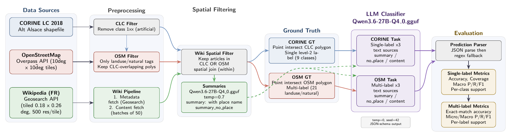

# GeoReset

GeoReset experiments with whether geolocated Wikipedia text can help an LLM
infer land-cover labels, evaluated against CORINE level-2 classes and
project-scoped OSM land-cover tags.

- Project site: https://geo-reset.sylvainlobry.com/
- Code repository: https://github.com/NoeFlandre/georeset
- Data bucket: https://huggingface.co/buckets/NoeFlandre/georeset

## Code And Data Split

GitHub stores source code, tests, Docker configuration, and documentation.
Generated and downloaded project data lives in the Hugging Face bucket. Keep
`data/` out of Git.

Download or refresh data from Hugging Face:

```bash
hf sync hf://buckets/NoeFlandre/georeset ./data
```

Upload local data changes back to Hugging Face:

```bash
hf sync ./data hf://buckets/NoeFlandre/georeset --delete --exclude '**/.DS_Store' --exclude '.DS_Store'
```

Before committing code, check that no data files are staged:

```bash
git status --short
git ls-files data build
```

`git ls-files data build` should print nothing. If data was staged by mistake:

```bash
git rm -r --cached data build
git add .gitignore README.md docs src scripts tests pyproject.toml uv.lock LICENSE Dockerfile .dockerignore .github
```

## Repository Layout

- `src/georeset/`: installable Python package. The wheel packages only this
  tree.
- `src/georeset/fetchers/data_fetcher.py`: loads CORINE shapefiles and exposes bounds,
  class labels, centroids, and samples.
- `src/georeset/fetchers/wiki_fetcher.py`: fetches French Wikipedia geosearch metadata
  inside the CORINE bounds and project polygon filters.
- `src/georeset/fetchers/wiki_content_fetcher.py`: fetches full Wikipedia extracts from
  page IDs. It sanitizes existing output, skips already-fetched entries, writes
  checkpoints after each batch, and can be stopped/resumed at any time.
- `src/georeset/fetchers/osm_fetcher.py`: fetches project-relevant OSM land-cover
  polygons from Overpass.
- `src/georeset/analysis/corine_polygon_stats.py`: computes CORINE class area/share
  distributions inside OSM polygons.
- `src/georeset/analysis/distribution_summary.py`: summarizes distribution outputs.
- `src/georeset/visualization/map_visualizer.py`: writes Folium map visualizations.
- `src/georeset/cli/`: packaged CLI implementations exposed through
  `[project.scripts]` entry points such as `georeset-classify-articles`,
  `georeset-summarize-articles`, and `georeset-run-corine-analysis`.
- `scripts/`: thin repository-compatible wrappers around `georeset.cli.*` plus
  Grid5000 shell launchers. Prefer the `georeset-*` entry points in new docs and
  automation.
- `src/georeset/classification/`: label utilities, ground-truth builders, LLM
  classifier, and metrics for CORINE level-2 and OSM tag classification.
- `src/georeset/spatial/corine_confidence.py`: CORINE buffer-purity diagnostics
  in EPSG:2154 for spatial-confidence experiments.
- `scripts/cluster/submit_summarization.sh`: syncs the minimal repository
  state to Grid5000/Nancy and submits summarization OAR jobs. Auto-sync is
  disabled by default; use one-shot syncs to avoid repeated SSH polling.

## Data Artifacts

These files are expected under `data/` after syncing the bucket:

- `data/corine/`: CORINE shapefile and bounds.
- `data/wiki/wiki_articles.json`: Wikipedia geosearch metadata.
- `data/wiki/article_contents.json`: resumable Wikipedia article content.
- `data/osm/osm_project_polygons.geojson`: project-relevant OSM polygons.
- `data/distribution/osm_corine_distribution.csv`: CORINE class area/share
  distribution inside OSM polygons.
- `data/maps/`: generated HTML visualizations.
- `data/classification/`: local working classification predictions and metrics.
- `data/experiments/`: frozen experiment folders and derived analysis tables.

The source CORINE data was downloaded from:
https://www.datagrandest.fr/geonetwork/srv/api/records/c0ccbf45-2620-4bde-93f8-869558e51d7e?language=fre

## Local Setup

Install dependencies with `uv`:

```bash
uv sync --group dev
hf sync hf://buckets/NoeFlandre/georeset ./data
```

The default development and CI environment uses the `dev` group only. LLM/GPU
workflows additionally need the optional `llm` group:

```bash
uv sync --group dev --group llm
```

Run tests:

```bash
PYTHONDONTWRITEBYTECODE=1 uv run pytest
```

Run the full local quality gate:

```bash
PYTHONDONTWRITEBYTECODE=1 uv run ruff check .
PYTHONDONTWRITEBYTECODE=1 uv run ruff format --check .
PYTHONDONTWRITEBYTECODE=1 uv run mypy src scripts
PYTHONDONTWRITEBYTECODE=1 uv run pytest -q
```

Run only the resumable Wikipedia content fetcher tests:

```bash
PYTHONDONTWRITEBYTECODE=1 uv run pytest tests/fetchers/test_wiki_content_fetcher.py -q
```

## Pipeline Commands

Installable commands are exposed as `georeset-*` entry points. The top-level
`scripts/` modules are kept as thin repository wrappers for backwards
compatibility, but they are not part of the installed wheel.

Print a quick dataset snapshot:

```bash
PYTHONDONTWRITEBYTECODE=1 uv run georeset-snapshot
```

Fetch Wikipedia article metadata:

```bash
PYTHONDONTWRITEBYTECODE=1 uv run python -m georeset.fetchers.wiki_fetcher
```

Fetch full Wikipedia article content. This command is resumable: stop it with
`Ctrl-C`, then run it again and it will skip sane entries already saved in
`data/wiki/article_contents.json`.

```bash
PYTHONDONTWRITEBYTECODE=1 uv run python -m georeset.fetchers.wiki_content_fetcher
hf sync ./data hf://buckets/NoeFlandre/georeset --delete --exclude '**/.DS_Store' --exclude '.DS_Store'
```

Regenerate the CORINE + Wikipedia article map:

```bash
PYTHONDONTWRITEBYTECODE=1 uv run python -m georeset.visualization.map_visualizer
```

Fetch/use OSM polygons, compute CORINE distributions, and generate the separate
CORINE + OSM map:

```bash
PYTHONDONTWRITEBYTECODE=1 uv run georeset-run-corine-analysis
hf sync ./data hf://buckets/NoeFlandre/georeset --delete --exclude '**/.DS_Store' --exclude '.DS_Store'
```

Run the full filter pipeline with existing local OSM/Wikipedia inputs:

```bash
PYTHONDONTWRITEBYTECODE=1 uv run georeset-filter-pipeline --dry-run
PYTHONDONTWRITEBYTECODE=1 uv run georeset-filter-pipeline
```

Use `--refetch-osm` or `--refetch-wiki` only when you explicitly want fresh
network fetches. The pipeline validates required inputs before write/prune
steps, prunes both summary variants, and writes JSON/CSV/GeoJSON/HTML/parquet
artifacts through atomic temp-file replacement helpers.

## Grid5000 Article Summarization

Two summary variants are supported and must be generated with distinct
`--summary-mode` values:

- `place`: normal one-sentence summary; place names may appear.
- `no_place`: one-sentence summary that asks the model not to mention the
  described place name.

The standard summary job writes `data/wiki/article_summaries.json`:

```bash
bash scripts/cluster/submit_summarization.sh
```

The remote job installs `uv` if needed, syncs the project with the `dev` and
`llm` dependency groups (`uv sync --group dev --group llm`) for CUDA
`llama-cpp-python`, and runs:

```bash
uv run georeset-summarize-articles \
  --input-path data/wiki/article_contents.json \
  --output-path data/wiki/article_summaries.json \
  --summary-mode place
```

The no-place job writes `data/wiki/article_summaries_no_place.json`:

```bash
uv run georeset-summarize-articles \
  --input-path data/wiki/article_contents.json \
  --output-path data/wiki/article_summaries_no_place.json \
  --summary-mode no_place
```

Optional environment overrides:

```bash
G5K_SITE=nancy G5K_REMOTE_DIR=georeset G5K_REMOTE_HOME=/home/nflandre \
GEORESET_MODEL_PATH=Qwen3.6-27B-Q4_0.gguf \
  bash scripts/cluster/submit_summarization.sh
```

Sync a finished summary job with one SSH polling pass:

```bash
GEORESET_SUMMARY_OUTPUT=data/wiki/article_summaries.json \
SYNC_ONCE=1 bash scripts/cluster/sync_summaries.sh
```

## Article-Text Land-Cover Classification

Six primary classification runs are supported: 2 tasks (CORINE level-2 single-label, OSM multi-label) × 3 text sources (normal summary, no-place summary, raw article content). The same three text sources also have deterministic shuffled controls: `summary_shuffled`, `summary_no_place_shuffled`, and `content_shuffled`. Shuffled controls preserve the task, targets, and eligible article set, but reassign texts across eligible articles with the run seed and store `shuffled_from_pageid` in prediction metadata.

Local runs:

```bash
PYTHONDONTWRITEBYTECODE=1 uv run georeset-classify-articles \
  --task corine_level2 --text-source summary
PYTHONDONTWRITEBYTECODE=1 uv run georeset-classify-articles \
  --task corine_level2 --text-source summary_no_place
PYTHONDONTWRITEBYTECODE=1 uv run georeset-classify-articles \
  --task corine_level2 --text-source content
PYTHONDONTWRITEBYTECODE=1 uv run georeset-classify-articles \
  --task osm --text-source summary
PYTHONDONTWRITEBYTECODE=1 uv run georeset-classify-articles \
  --task osm --text-source summary_no_place
PYTHONDONTWRITEBYTECODE=1 uv run georeset-classify-articles \
  --task osm --text-source content
```

Shuffled-control local runs:

```bash
PYTHONDONTWRITEBYTECODE=1 uv run georeset-classify-articles \
  --task corine_level2 --text-source summary_shuffled
PYTHONDONTWRITEBYTECODE=1 uv run georeset-classify-articles \
  --task corine_level2 --text-source summary_no_place_shuffled
PYTHONDONTWRITEBYTECODE=1 uv run georeset-classify-articles \
  --task corine_level2 --text-source content_shuffled
PYTHONDONTWRITEBYTECODE=1 uv run georeset-classify-articles \
  --task osm --text-source summary_shuffled
PYTHONDONTWRITEBYTECODE=1 uv run georeset-classify-articles \
  --task osm --text-source summary_no_place_shuffled
PYTHONDONTWRITEBYTECODE=1 uv run georeset-classify-articles \
  --task osm --text-source content_shuffled
```

Outputs:
- `data/classification/{task}_{text_source}_predictions.json`: per-article predictions with raw LLM response, parsed `prediction`, a normalized `prediction_labels` list, and full metadata including fingerprint.
- `data/classification/{task}_{text_source}_metrics.json`: aggregate metrics (n_eligible, n_predicted_ok, n_parse_error, coverage, accuracy/F1 scores, task, text_source, allowed_labels, labels_evaluated).

Resumability: articles with matching fingerprint and `parse_status=="ok"` are skipped; parse errors and ambiguous predictions are re-run. A classification policy version bump in the fingerprint invalidates old caches automatically. Use `--limit N` for smoke testing.

Label Policies:
- **OSM** is fully multi-label. Ground truth and predictions support multiple valid tags (e.g., both `landuse` and `natural` from the same polygon, or from overlapping polygons).
- **CORINE** remains single-label. If the LLM generates multiple valid labels for a single CORINE prediction, it is flagged as `parse_status="ambiguous"`. Ambiguous records are excluded from metrics (lowering coverage) but are preserved for audit.

Grid5000 runs:

```bash
GEORESET_CLASSIFICATION_TASK=corine_level2 \
GEORESET_CLASSIFICATION_TEXT_SOURCE=summary \
bash scripts/cluster/submit_classification.sh
```

Grid5000 shuffled-control runs use the same launcher with a shuffled text
source. Classification jobs request one GPU for 20 hours by default in
`scripts/cluster/run_classification_job.sh`. Auto-sync is disabled by default to
avoid repeated SSH polling; sync finished jobs with one-shot syncs only:

```bash
GEORESET_CLASSIFICATION_TASK=corine_level2 \
GEORESET_CLASSIFICATION_TEXT_SOURCE=summary_shuffled \
bash scripts/cluster/submit_classification.sh

GEORESET_CLASSIFICATION_TASK=corine_level2 \
GEORESET_CLASSIFICATION_TEXT_SOURCE=summary_shuffled \
SYNC_ONCE=1 bash scripts/cluster/sync_classification.sh
```

To freeze the shuffled-control batch after all six shuffled outputs are synced
locally, or to regenerate overview tables for any experiment directory:

```bash
PYTHONDONTWRITEBYTECODE=1 uv run georeset-summarize-classification-experiment \
  --experiment-dir data/experiments/article_text_classification_e2e_with_shuffled_control_v1 \
  --title "Article-Text Classification E2E with Shuffled Control v1"
```

## CORINE Spatial Confidence And Spatial-Subset Evaluation

The spatial-confidence experiment does not rerun the LLM. It derives CORINE
level-2 point labels from the full CORINE dataset, validates them against frozen
CORINE prediction targets where available, computes area-weighted buffer purity
at 100 m, 250 m, 500 m, and 1000 m in EPSG:2154, and keeps artificial classes as
ambiguity evidence.

```bash
PYTHONDONTWRITEBYTECODE=1 uv run georeset-compute-corine-spatial-confidence \
  --parent-experiment-dir data/experiments/article_text_classification_e2e_with_shuffled_control_v1 \
  --output-dir data/experiments/corine_spatial_confidence_v1
```

Reevaluate the frozen parent predictions on spatially reliable subsets without
changing prompts, summaries, model outputs, or temperature:

```bash
PYTHONDONTWRITEBYTECODE=1 uv run georeset-evaluate-spatial-confidence \
  --parent-experiment-dir data/experiments/article_text_classification_e2e_with_shuffled_control_v1 \
  --spatial-confidence-path data/experiments/corine_spatial_confidence_v1/spatial_confidence.csv \
  --output-dir data/experiments/article_text_classification_spatial_confidence_v1
```

## Docker

The Docker image contains the installable `georeset` package, packaged CLI
entry points, thin top-level `scripts/` wrappers for repository compatibility,
tests, and Python dependencies. It intentionally does not bake in `data/`;
mount local synced data at `/app/data`.

Build the image:

```bash
docker build -t georeset .
```

Run a quick container smoke test:

```bash
docker run --rm georeset
```

Run tests in Docker:

```bash
docker run --rm -v "$PWD/data:/app/data" georeset uv run pytest tests/fetchers/test_wiki_content_fetcher.py -q
```

Run a packaged CLI smoke test in Docker:

```bash
docker run --rm -v "$PWD/data:/app/data" georeset uv run georeset-snapshot
```

Run a pipeline command in Docker:

```bash
hf sync hf://buckets/NoeFlandre/georeset ./data
docker run --rm -v "$PWD/data:/app/data" georeset uv run python -m georeset.fetchers.wiki_content_fetcher
hf sync ./data hf://buckets/NoeFlandre/georeset --delete --exclude '**/.DS_Store' --exclude '.DS_Store'
```

The regular Docker image syncs the `dev` dependency group, not the optional
`llm` group, so it is suitable for tests and non-LLM pipeline commands. GPU LLM
workloads should use Grid5000 scripts or an environment created with
`uv sync --group dev --group llm`.

## OSM Scope

OSM fetching is intentionally restricted to project-relevant land-cover tags.
It excludes dense or unrelated tags such as buildings, amenities, commercial,
industrial, residential, and leisure features.

Included `landuse` values:

```text
farmland, farmyard, meadow, orchard, vineyard, forest, allotments,
plant_nursery, greenhouse_horticulture, grass
```

Included `natural` values:

```text
wood, scrub, grassland, wetland, heath, water, bare_rock, sand, scree,
shingle, beach, mud
```

## Publishing Workflow

Use this split every time:

1. Code/docs/tests go to GitHub.
2. Generated/downloaded artifacts go to the Hugging Face bucket.
3. Do not commit `data/`, `build/`, caches, or local environment files.

Code push:

```bash
git status --short
git add .gitignore README.md docs Dockerfile .dockerignore src scripts tests pyproject.toml uv.lock LICENSE .github
git commit -m "Describe code change"
git push origin main
```

Data push:

```bash
hf sync ./data hf://buckets/NoeFlandre/georeset --delete --exclude '**/.DS_Store' --exclude '.DS_Store'
```
